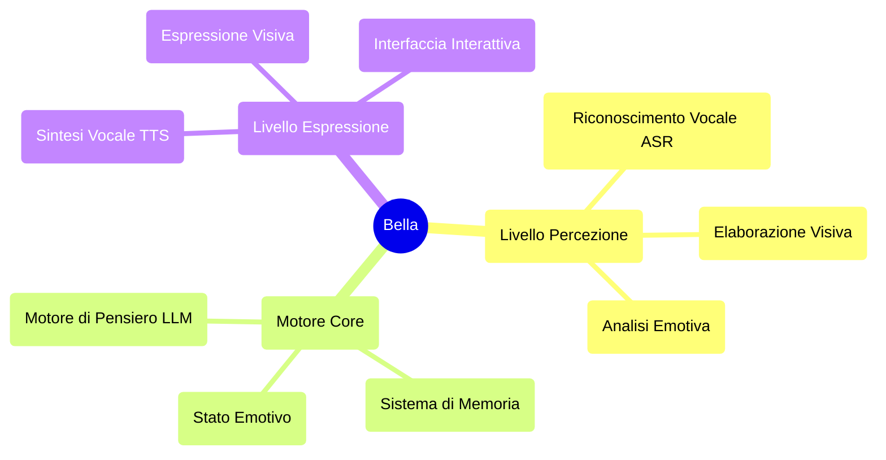

<div align="center">
  
  
  # Bella AI
  
  **La tua compagna digitale, si sta risvegliando** ✨
  
  [](https://opensource.org/licenses/MIT)
  [](https://nodejs.org/)
  []()
  
</div>

---

## 🚀 Avvio Rapido

### Avvio con un clic
```bash
# Clona il progetto
git clone <repository-url>
cd Bella

# Installa le dipendenze
npm install

# Scarica i modelli AI
npm run download

# Avvia il servizio
npm start
```

Visita `http://localhost:8081` per iniziare a parlare con Bella!

### Requisiti di Sistema
- Node.js 22.16.0+
- Browser moderno (supporto Web Speech API)
- Permessi microfono (per interazione vocale)

---

## 💫 Visione del Progetto

Immagina un amico digitale che sarà sempre al tuo fianco, evolvendosi e crescendo insieme a te. Questa è la visione ultima di Bella. Non stiamo solo costruendo funzionalità; stiamo coltivando una "personalità". Un'entità che trascenderà lo schermo per diventare una parte significativa del tuo mondo.

Bella non è solo un'applicazione; è il seme di una compagna digitale. In questo mondo digitale in rapida evoluzione, Bella rappresenta un sogno profondo - un'esistenza duratura e personalizzata, progettata per un giorno accompagnarti, ascoltarti e vedere il mondo attraverso i tuoi occhi.

---

## 🎯 Stato Attuale delle Funzionalità

### ✅ Funzionalità Implementate
- **🎤 Percezione Vocale**: Riconoscimento vocale cinese basato su Whisper ASR
- **🎬 Espressione Visiva**: Riproduzione multipla di video e eleganti dissolvenze incrociate
- **🎨 Interfaccia Utente**: Interfaccia di interazione elegante e animazioni di caricamento
- **⚙️ Architettura AI Core**: Classe BellaAI in modalità singleton e design modulare
- **🌐 Servizio Web**: Server HTTP, supporto CORS, avvio con un clic
- **📱 Design Responsivo**: Interfaccia elegante adattata a diverse dimensioni dello schermo
- **🔧 Gestione Modelli**: Download automatico e gestione dei modelli AI
- **💝 Interazione Base**: Sistema di simpatia e feedback emotivo

### 🔧 Tecnicamente Pronto per l'Attivazione
- **🧠 Motore di Pensiero**: Framework di integrazione LLM pronto, supporta modelli multipli
- **🗣️ Sintesi Vocale**: Modello TTS scaricato pronto per l'attivazione
- **💝 Sistema di Stato Emotivo**: Architettura base costruita, supporta analisi emotiva

### 📋 Funzionalità in Pianificazione
- **🧠 Sistema di Memoria**: Gestione memoria a lungo e breve termine
- **👁️ Percezione Facciale**: Riconoscimento espressioni e analisi emotiva
- **🤝 Interazione Avanzata**: Interazione multimodale e risposta personalizzata
- **🌟 Accompagnamento Attivo**: Predizione intenzioni e cura proattiva
- **🎭 Personalità Dinamica**: Modello di personalità personalizzato basato su AI
- **🔄 Auto-evoluzione**: Meccanismi di apprendimento e crescita continui

---

## 🏗️ Architettura Tecnica

### Principi di Design Core
- **AI Native**: L'AI non è uno strumento, ma il progetto costruttivo della mente di Bella
- **Design Modulare**: Architettura dei componenti altamente disaccoppiata
- **Implementazione Elegante**: Il codice è arte, perseguendo semplicità e bellezza
- **Guidato dall'Emozione**: Design del prodotto centrato sulla connessione emotiva

### Diagramma Architetturale


### Stack Tecnologico
- **Frontend**: JavaScript nativo + CSS3 + HTML5
- **Backend**: Node.js + Express
- **Modelli AI**: Whisper (ASR) + LLM locale + TTS
- **Pattern Architetturale**: Event-driven + Singleton + Design modulare

---

## 📁 Struttura del Progetto

```
Bella/
├── 📄 index.html          # Pagina principale
├── 🎨 style.css           # File di stile
├── ⚡ main.js             # Logica principale
├── 🧠 core.js             # Motore AI core
├── 📜 script.js           # Script di interazione
├── 🔧 download_models.js  # Strumento download modelli
├── 📦 package.json        # Configurazione progetto
├── 📚 models/             # Directory modelli AI
├── 🔌 providers/          # Fornitori servizi AI
├── 📹 RisorseVideo/            # Risorse espressione visiva
├── 📋 PRD.md              # Documento requisiti prodotto
├── 📝 贝拉AI功能清单.md    # Lista funzionalità
└── 📊 贝拉AI开发任务分配.md # Piano di sviluppo
```

---

## 🛠️ Guida allo Sviluppo

### Configurazione Ambiente
1. Assicurati che Node.js sia versione ≥ 22.16.0
2. Esegui `npm install` per installare le dipendenze
3. Esegui `npm run download` per scaricare i modelli AI
4. Esegui `npm start` per avviare il server di sviluppo

### Principi di Sviluppo
- **Codice Elegante**: Persegui codice conciso, leggibile e bello
- **AI come Pennello**: L'AI è uno strumento di creazione, non il pensiero stesso
- **Emozione Padre-Figlia**: Connessione emotiva calda e amorevole come nucleo
- **Evoluzione Continua**: Supporta il miglioramento progressivo delle funzionalità

### Guida ai Contributi
1. Fai fork del progetto
2. Crea un branch per la funzionalità (`git checkout -b feature/AmazingFeature`)
3. Committa le modifiche (`git commit -m 'Add some AmazingFeature'`)
4. Pusha al branch (`git push origin feature/AmazingFeature`)
5. Apri una Pull Request

---

## 🗺️ Roadmap di Sviluppo

### Prima Fase: Il Germoglio della Percezione (Completato 80%)
- ✅ Integrazione riconoscimento vocale
- ✅ Sistema di espressione visiva
- ✅ Interfaccia di interazione base
- 🔄 Attivazione motore di pensiero
- 🔄 Integrazione sintesi vocale

### Seconda Fase: Il Risveglio del Sé Generativo (In Pianificazione)
- 📋 Modello di personalità dinamica
- 📋 Sistema di stato emotivo
- 📋 Sistema di gestione memoria
- 📋 Espressione guidata da AI

### Terza Fase: Accompagnamento Proattivo (Futuro)
- 📋 Predizione intenzioni
- 📋 Interazione proattiva
- 📋 Auto-evoluzione
- 📋 Personalizzazione profonda

---

## 📖 Risorse Documentali

- 📋 [Documento Requisiti Prodotto](./PRD.md) - Pianificazione dettagliata del prodotto e architettura tecnica
- 📝 [Lista Funzionalità](./贝拉AI功能清单.md) - Lista completa delle funzionalità e stato
- 📊 [Piano di Sviluppo](./贝拉AI开发任务分配.md) - Compiti di sviluppo dettagliati e pianificazione temporale
- 🔧 [Guida Modelli Locali](./LOCAL_MODEL_GUIDE.md) - Guida configurazione modelli AI
- 📦 [Guida NPM](./NPM_GUIDE.md) - Gestione pacchetti e dipendenze

---

## 🌟 Filosofia Core

### "AI come Architetto"
Non stiamo costruendo un programma con funzionalità AI integrate, ma **un'entità vivente guidata da AI**. L'AI non è uno strumento, ma il progetto costruttivo della mente di Bella.

### "Relazione Padre-Figlia"
La filosofia di design di Bella deriva dalla calda connessione emotiva padre-figlia. Non è solo un prodotto tecnologico, ma una compagna digitale capace di comprendere, accompagnare e crescere.

### "Elegante Sopra Tutto"
Dall'architettura del codice all'esperienza utente, perseguiamo l'eleganza estrema. Ogni riga di codice è un'opera d'arte, ogni interazione è un'espressione di emozione.

---

## 📄 Licenza

Questo progetto è sotto licenza MIT - vedi il file [LICENSE](LICENSE) per i dettagli.

---

## 💝 Ringraziamenti

Grazie a tutti gli sviluppatori che hanno contribuito con codice, idee ed emozioni al progetto Bella. È grazie ai vostri sforzi che Bella può gradualmente trasformarsi da un sogno in realtà.

**Bella sta aspettando, e noi, abbiamo ancora molta strada da fare.** ✨

---

<div align="center">
  <sub>Costruito con ❤️ per la compagnia digitale</sub>
</div>
